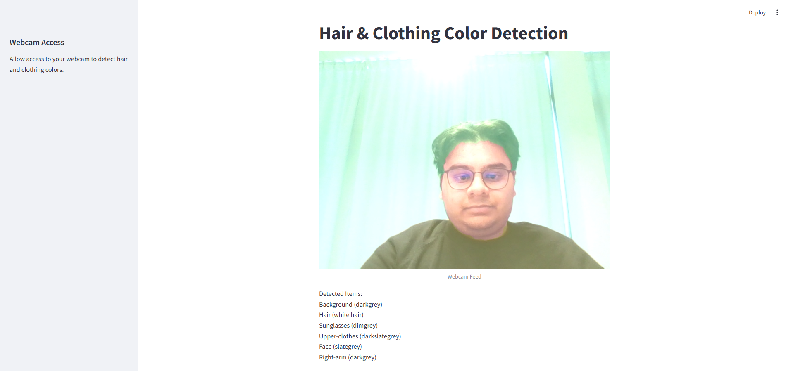

# C3L Detection and Segmentation

## Installation Guide

Make sure you have Python installed on your system. You can download it from [here](https://www.python.org/downloads/).

After that, you need to install the necessary dependencies. You can do this by running the following command:

```bash
pip install -r requirements.txt
```

Once you have installed the dependencies, you can run the program by executing the  following command:

```bash
python script.py
```

> Replace `script.py` with the name of the script you want to run.

You may have to change directory to the location of the script before running the command.

## Usage

The scripts whose filename start with `combined_` are the main scripts that you should run. They contains the code for the entire pipeline. The scripts whose filename start with `detect_` are the scripts that contain 1 pipeline step. You can run them individually if you want, but they only do the task described in the filename.

## Streamlit DEMO

To run the Streamlit demo, you need to run the following commands:

```bash
cd /app/
streamlit run main.py
```

It should look like this:


